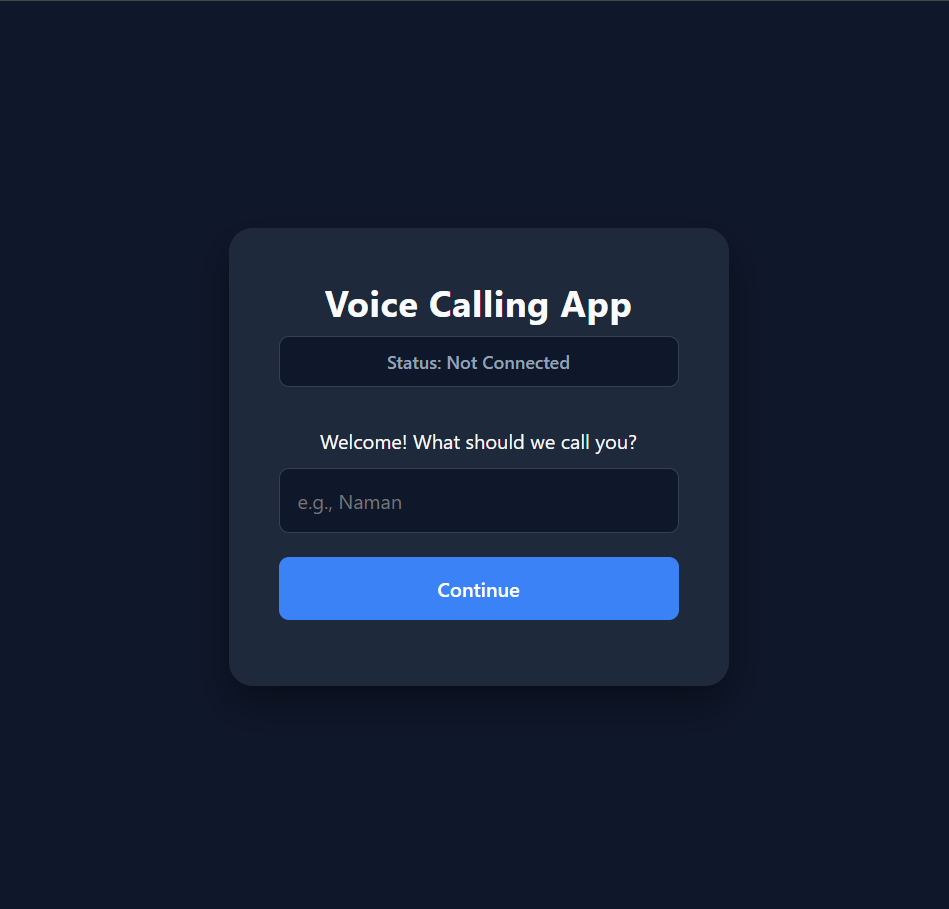
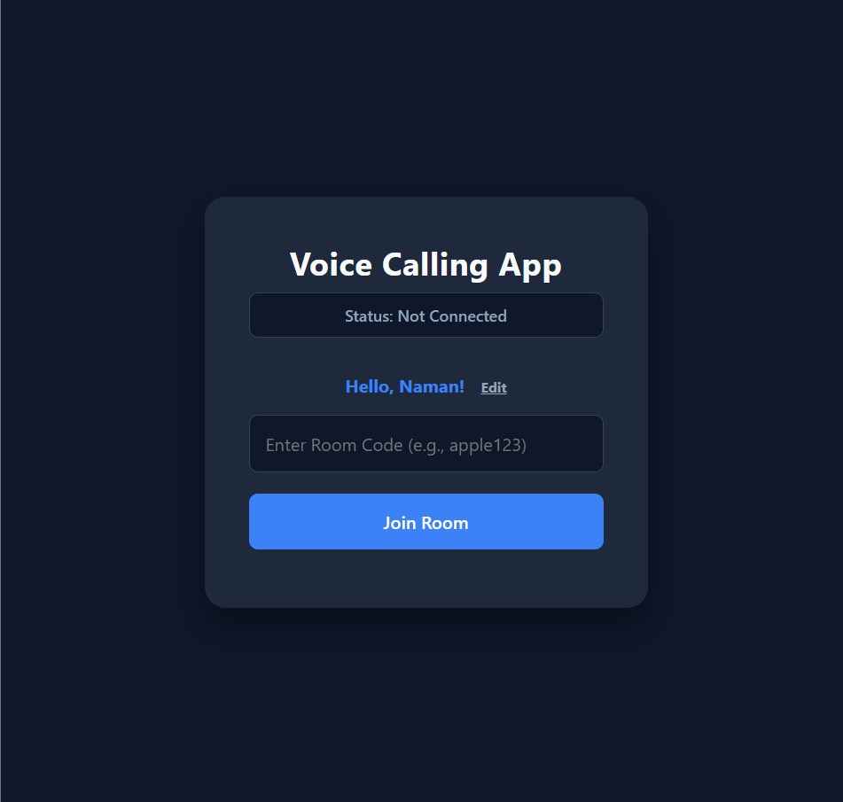
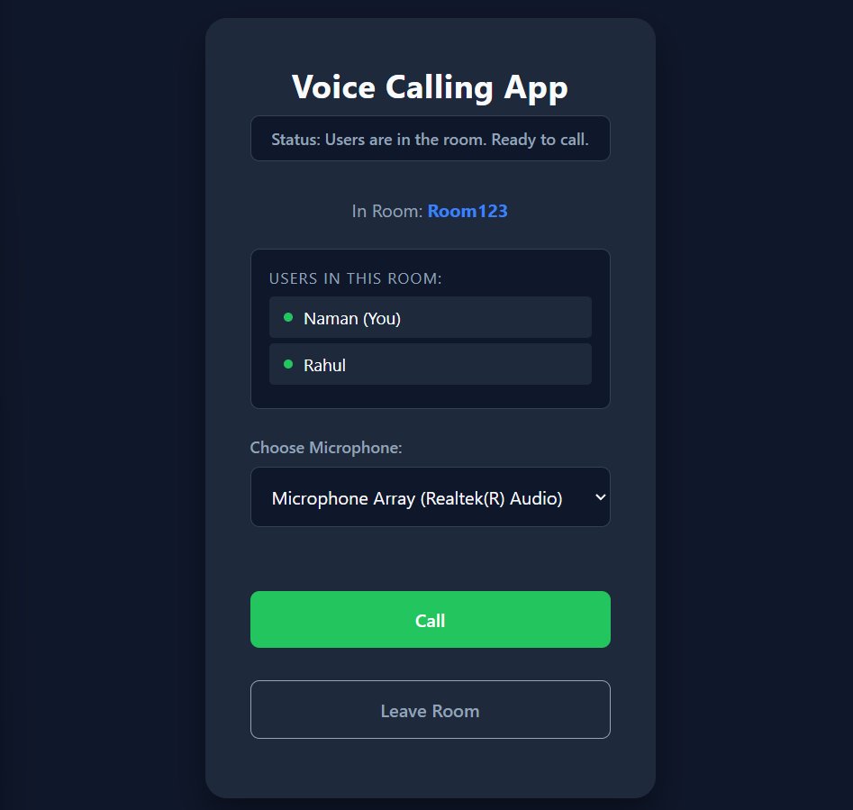
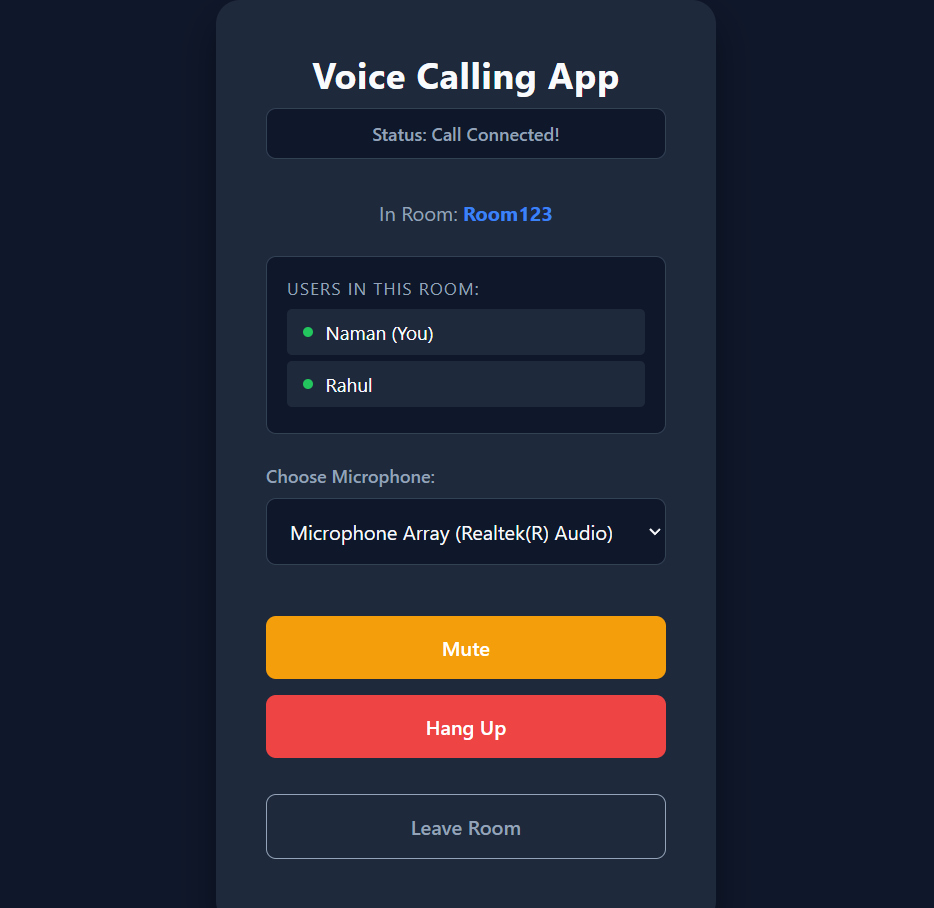

# 📞 WebRTC VoIP Calling App


---

## 📸 Preview

<p align="center">
  
  
</p>

<p align="center">
  
  
</p>

---

🚀 **[Try the Live Demo Here!](https://calling-x1jf.onrender.com/)**

---

## 🧩 Overview

A real-time, peer-to-peer audio calling application built using modern web technologies.  
This app enables users to create private rooms and make seamless voice calls directly from their browsers — no accounts, no plugins.

---

## ✨ Features

- 🔐 **Room-Based Calling**  
  Create or join private rooms using unique codes.

- ⚡ **Peer-to-Peer Audio (WebRTC)**  
  Ultra-low latency communication with direct browser connections.

- 👥 **Live User Lobby**  
  See all active users in a room in real-time.

- 🎛️ **Smart Call Controls**  
  Dynamic UI for Call, Mute, and Hang Up actions.

- 💾 **Persistent Preferences**  
  Saves username & microphone selection using `localStorage`.

- 🎙️ **Device Selection**  
  Supports multiple audio input devices.

---

## 🧠 How It Works

### 📡 1. VoIP (Voice over Internet Protocol)
Converts voice into digital packets transmitted over the internet instead of traditional phone lines.

---

### 🌐 2. WebRTC (Web Real-Time Communication)

- Enables **direct browser-to-browser communication**
- Handles:
  - Echo cancellation
  - Noise suppression
  - Audio processing

👉 Once connected, audio bypasses the server entirely.

---

### 🔁 3. Signaling via Socket.io

Before P2P connection:

1. User A sends an **Offer**
2. Server relays it to User B
3. User B sends an **Answer**
4. Connection established 🎉

Server acts only as a **mediator**, not part of the call stream.

---

## 🚀 Setup & Installation

### 📌 Prerequisites

- Node.js (v14+)
- Modern browser (Chrome / Edge / Firefox / Safari)

---

### 📦 Installation

```bash
# Clone the repo
git clone <your-repo-link>

# Navigate into project
cd voip-calling-app

# Install dependencies
npm install
```

### Running the Server
Start the local Node.js signaling server:

```bash
npm start
# OR
node server.js
```

### Launch the Application
Open your web browser and navigate to:

```
http://localhost:3000
```

---

## 🛠️ Tech Stack

* **Frontend:** HTML5, Vanilla JavaScript (ES6+)
* **Styling:** Modern CSS3 (Flexbox, Custom Properties)
* **Real-Time Communication:** WebRTC
* **Signaling Server:** Node.js, Express.js, Socket.io
* **Deployment:** Render

---

## 🙏 Acknowledgments

* Thanks to the open-source community for WebRTC and Socket.io.
* Built with learning and experimentation in mind.
